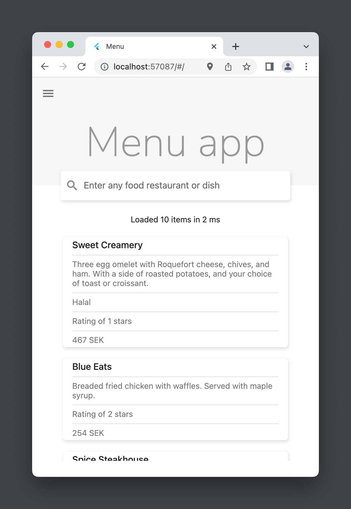
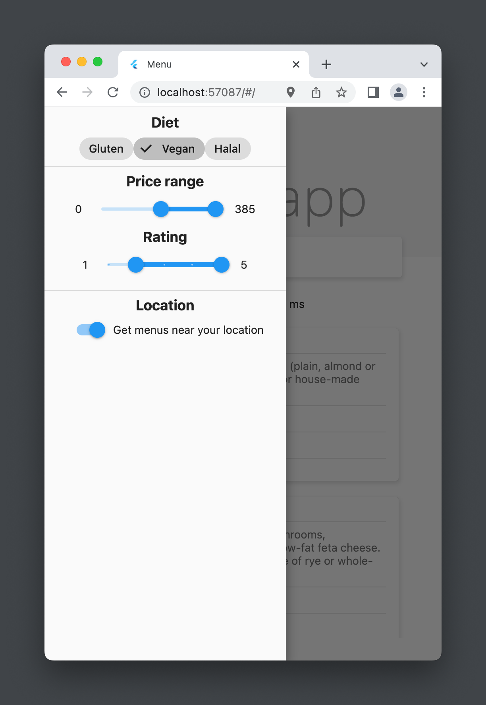

# Menu app

A search engine for exploring different menus, this repo is only for the frontend.
## Demo

## Environment

- macOS / Windows (should work on Linux too)
- Flutter 3.7
- Dart 2.19

## Getting started

### Backend

See [backend repo](https://url-to-backend-repo)

### Run in dev

`flutter run --device-id=chrome --web-renderer=html --enable-impeller`

### Run with custom backend endpoint

To set a custom server url, define the serverUrl variable

`flutter run --dart-define=serverUrl=https://something.us.ngrok.io -d chrome`

## Improvements

- Write proper tests
- Restructure
- Refactor ugly parts and keep it DRY

## Development

See [dev.md](dev.md)
